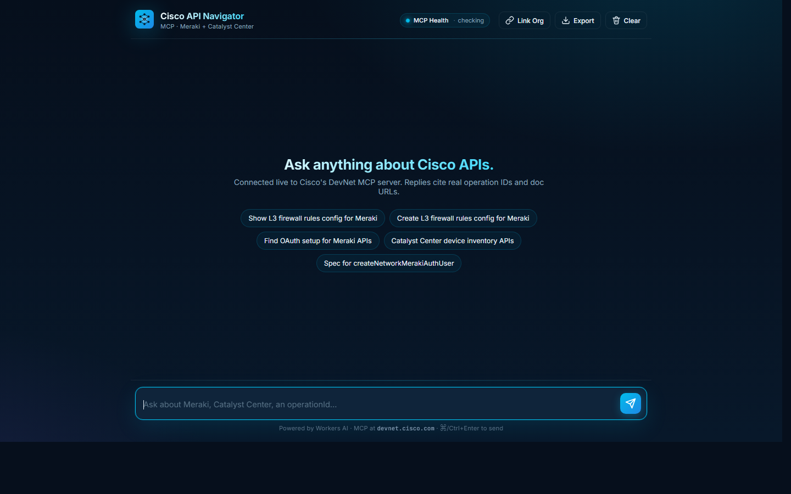

# Cisco API Navigator

A beautiful chat interface for Cisco's [DevNet Content Search MCP server](https://github.com/CiscoDevNet/devnet-content-search-mcp), running on Cloudflare Workers with Claude Opus 4.8.

> Live: **https://devnet-mcp.clydeford.net**



Ask anything about Cisco APIs and get a streamed, code-formatted answer grounded in real Meraki and Catalyst Center documentation. Every reply is backed by a fresh search of Cisco's hosted MCP server, so endpoints, operation IDs, and OpenAPI specs come straight from the source.

## What it does

- Each user message triggers parallel calls to the official DevNet MCP tools:
  - `Meraki-API-Doc-Search`
  - `CatalystCenter-API-Doc-Search`
- Results are stuffed into the prompt as structured context.
- **Deterministic snippet builder** — the MCP server returns docs, not code, so the worker builds the curl example itself from each Meraki hit (`src/snippet-builder.ts`): exact method + templated path, correct headers, and a strict-JSON body extracted from the spec's request example. The model is instructed to reproduce the snippet verbatim and only change JSON values — it never writes curl or JSON structure freehand.
- **Claude Opus 4.8** (via the Anthropic API) writes the conversational reply, citing operation IDs and doc URLs. If no `ANTHROPIC_API_KEY` secret is configured, the worker falls back to Workers AI (`@cf/meta/llama-3.3-70b-instruct-fp8-fast`).
- The response streams token-by-token to the browser over SSE.

## UI features

- **Meraki-flavoured dark theme** — cyan / blue / purple accents with subtle radial glows.
- **Code blocks with copy buttons** — language tag in the header, syntax highlighting via highlight.js, one-click copy.
- **Creative typing indicator** — bouncing router / switch / access point / cloud icons (no boring dots) while the MCP search runs.
- **Smart auto-scroll** — sticks to the bottom while streaming; if you scroll up to read, it stops fighting you.
- **Export chat** — downloads the conversation as Markdown.
- **Clear chat** — confirm-then-wipe, persisted in `localStorage`.
- **Keyboard-first** — Enter to send, Shift+Enter for newline.
- **Suggestion chips** — prefilled prompts to get started.
- **Mobile responsive** — works fine on phones.

## `/api/sandbox-call` security model

"Push to DEV / Push to PROD" in the chat UI calls `POST /api/sandbox-call`, which can execute a real write against the Meraki Dashboard API using the server's `MERAKI_SANDBOX_API_KEY` secret. That is a real credential against real network gear, so the endpoint enforces (`src/sandbox-guard.ts`, wired in `src/index.ts`):

- **The server key is same-origin only.** If a request omits `x-user-meraki-key` (i.e. it wants to use the server's own secret), it must carry an `Origin` or `Referer` header matching this Worker's own origin. No `Origin`/`Referer` at all -- e.g. a bare `curl` -- is treated as cross-origin and refused (`403`), not trusted by default.

A caller supplying their own `x-user-meraki-key` is unaffected by the origin check above -- they're only ever driving their own credential.

## Stack

| Layer       | Tech                                                                 |
| ----------- | -------------------------------------------------------------------- |
| Runtime     | Cloudflare Workers                                                   |
| LLM         | Claude Opus 4.8 (`@anthropic-ai/sdk`); Workers AI llama 3.3 fallback |
| Knowledge   | Cisco DevNet MCP server (hosted, public)                             |
| Frontend    | Vanilla JS + `marked` + `highlight.js` + `DOMPurify` (all CDN)       |
| Styling     | Hand-rolled CSS, Inter + JetBrains Mono                              |
| Static      | Workers Static Assets (no separate CDN, no bundler)                  |

## Project layout

```
.
├── src/
│   ├── index.ts             # Worker entry: /api/chat, MCP client, AI streaming
│   ├── snippet-builder.ts   # Deterministic curl snippets from MCP spec excerpts
│   ├── chat-history.ts      # History shaping for the Anthropic Messages API
│   ├── upstream-body.ts     # Body forwarding rules for Meraki pushes
│   └── sandbox-guard.ts     # /api/sandbox-call security: origin gating, override lockdown, rate limit, audit log
├── public/
│   ├── index.html           # Chat shell
│   ├── styles.css           # Meraki theme + animations
│   ├── app.js               # Chat client (streaming, markdown, copy, export)
│   ├── detect-meraki-call.js  # Snippet → {method, path, body} for Push to DEV
│   └── parse-tolerant-json.js # Auto-repair of comment/quoting bugs in bodies
├── wrangler.jsonc        # Worker config + AI binding + custom domain
├── package.json
├── tsconfig.json
└── README.md
```

## Local development

```bash
npm install
npx wrangler dev
```

Then open `http://localhost:8787`. To use Claude locally, put your key in a (gitignored) `.dev.vars` file:

```
ANTHROPIC_API_KEY=sk-ant-...
```

Without it, the dev server proxies Workers AI through your Cloudflare account instead.

Run the test suite with `npm test`, or `npm run test:report` to regenerate `test-report.html`.

## Deployment

Once authenticated to Cloudflare:

```bash
npx wrangler deploy
```

The custom domain `devnet-mcp.clydeford.net` is declared in `wrangler.jsonc` — Wrangler will attach it on first deploy as long as `clydeford.net` lives on this Cloudflare account.

To enable Claude in production, set the API key as a secret:

```bash
npx wrangler secret put ANTHROPIC_API_KEY
```

To swap Claude models, edit `vars.ANTHROPIC_MODEL` in `wrangler.jsonc` (e.g. `claude-sonnet-4-6` for a cheaper tier). The Workers AI fallback model is `vars.AI_MODEL`.

## How it works (short version)

```
                  ┌────────────────────────────────────┐
 user prompt ───▶ │  Cloudflare Worker (/api/chat)     │
                  │                                    │
                  │   ① POST tools/call ×2 in parallel │ ──▶ devnet.cisco.com MCP
                  │   ② build <context> block +        │
                  │      deterministic curl snippets   │
                  │   ③ stream Claude Opus 4.8         │ ──▶ api.anthropic.com
                  │      (or Workers AI fallback)      │
                  │   ④ pipe SSE to client             │
                  └──────────────┬─────────────────────┘
                                 ▼
                        token-stream → browser
                        (markdown rendered as it arrives,
                         code blocks decorated, smart-scroll)
```

The MCP transport handshake (initialize → notifications/initialized → tools/call) is implemented inline in `src/index.ts` against the streamable-HTTP transport — no SDK required.

## Configuration knobs

All in `wrangler.jsonc` under `vars` (plus one secret):

- `MCP_URL` — defaults to Cisco's public MCP endpoint.
- `ANTHROPIC_MODEL` — Claude model for chat replies (default `claude-opus-4-8`).
- `AI_MODEL` — Workers AI fallback model, used when no Anthropic key is set.
- `ANTHROPIC_API_KEY` — secret (`wrangler secret put`); activates the Claude path.

## License

MIT. Cisco DevNet content fetched at runtime is governed by Cisco's own terms — see the [upstream project](https://github.com/CiscoDevNet/devnet-content-search-mcp).
